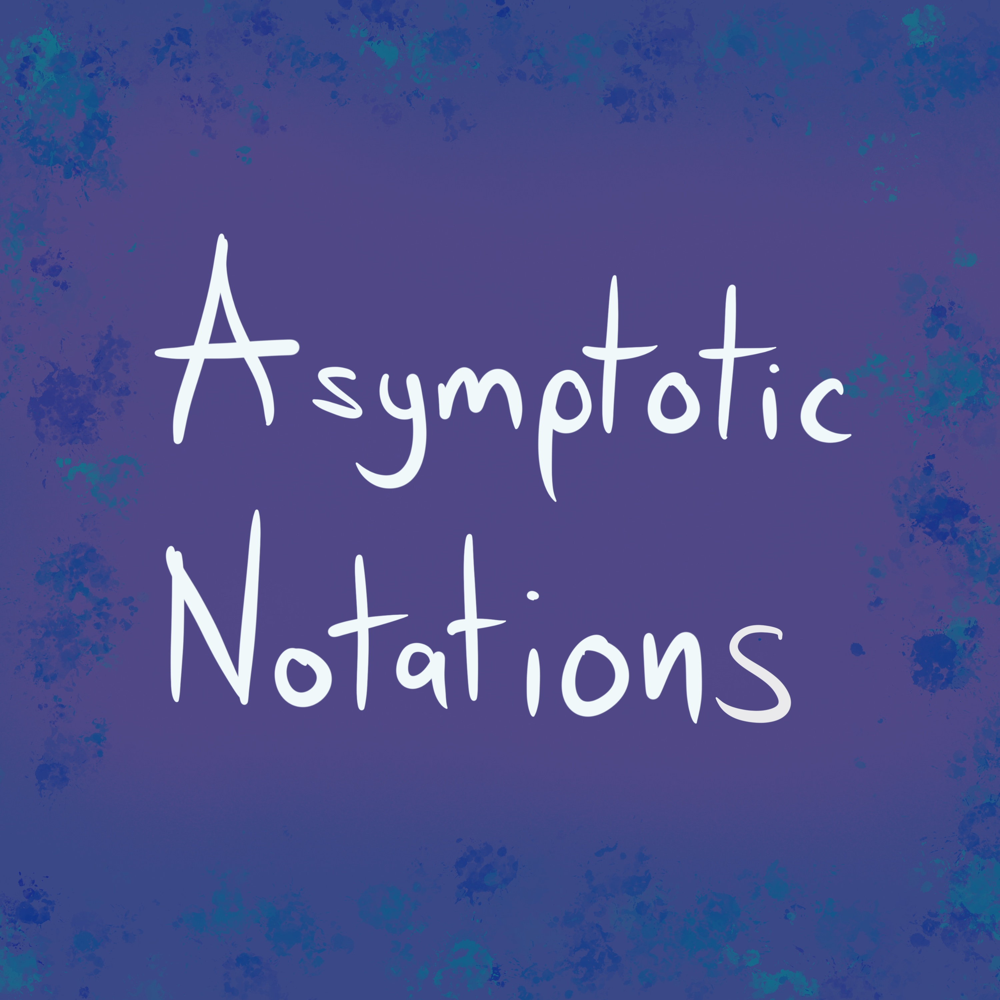

You can now listen to my new Album in Deezer, Spotify or iTunes! follow the [**link**](https://distrokid.com/hyperfollow/saulivanrivasvega/asymptotic-notations).

This release includes some not so worked tunes like `Little Omega`, but it also includes some of my favourites songs like a more personal one `Big Omega`, and sorry if you are not into Computer Science Terminology that actually has nothing to do with the process involved in their making. They are in fact made just using Apple loops in [GarageBand](https://apps.apple.com/us/app/garageband/id408709785).

### References

- [GarageBand](https://apps.apple.com/us/app/garageband/id408709785)
